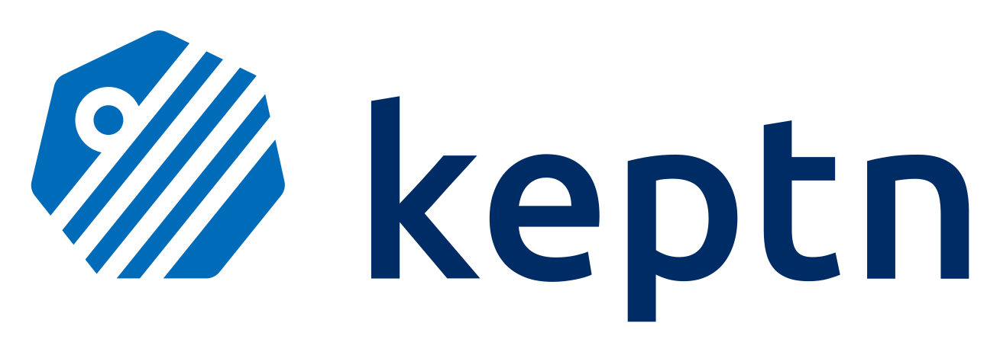
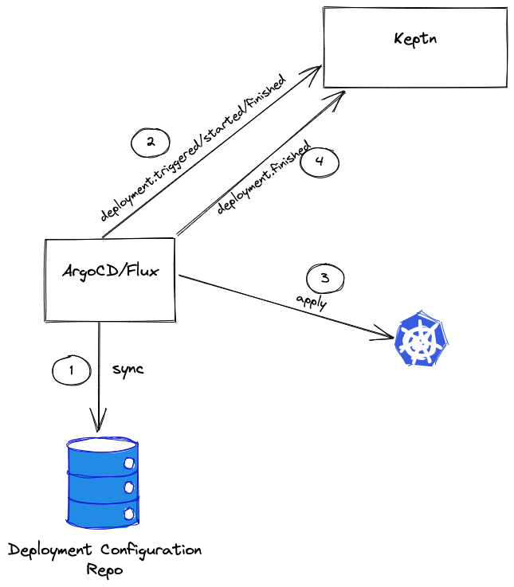

 

 

<h3>
 
Project Proposal
 
for
 
Integration for GitOps-based Deployment Tools (ArgoCD/Flux)
 
Mentors: <a href="https://github.com/bradmccoydev">Brad McCoy</a>, <a href="https://github.com/thschue">Thomas Schuetz</a>
</h3>

 

# Table Of Contents

- [Abstract](#abstract)
- [Problem Statement](#problem-statement)
- [Project Details / Scope of this project](#project-details--scope-of-this-project)
    - [Current status of the project](#current-status-of-the-project)
    - [Areas to work on](#areas-to-work-on)	
    - [Benefits to the community](#benefits-to-community)
- [Schedule of Deliverables](#schedule-of-deliverables)		
    - [Milestones](#milestones)				
    - [Timeline](#timeline)										
    - [Time Commitments](#time-commitments)					
- [General Notes](#general-notes)		
- [About Me](#about-me)
    - [Personal Information and Contact Details](#personal-information-and-contact-details)					
    - [Why Me?](#why-me)
    - [Past open source experience](#past-open-source-experience)			
- [Post GSoC Plans](#post-gsoc-plans)
- [Special note for the reviewers](#special-note-for-the-reviewers)

 

# **Abstract**

This is the project proposal for _Integration for GitOps-based Deployment Tools (e.g. ArgoCD/Flux)_ for Keptn on which I want to work as a part of Google Summer of Code 2022. I have proposed my timeline to complete this work in a span of 12 weeks.

Keptn is an event-driven orchestration engine for cloud-native apps. Started in 2018, it uses a declarative approach to automate delivery and operations so they can be scaled up to a large number of services. Keptn evaluates Service Level Indicators (SLOs) and provides a dashboard, alerts, and auto-remediation for them. It also provides integrations with the Cloud Native ecosystem including Prometheus, ArgoCD, CloudEvents, Backstage, and many other cloud-native projects.

 

# **Problem Statement**

The initial idea of this project was building an integration of gitops-based tools, like Flux or ArgoCD to let them interact with keptn.

For instance, ArgoCD or Flux should be able to sync with their GitOps repositories and when they start their tasks, they should notify keptn that something started or finished, to let keptn orchestrate the rest of the process (test/quality gating, etc.).

Argo/Flux is often used in the ecosystem and it would make sense to integrate this. As the deployment workflow itself might be triggered by the GitOps Framework (not by keptn), keptn needs to get information about a triggered/started/finished deployment. 

To be able to use GitOps tools in combination with keptn, the main goal of this project is to find a proper way how the tools could interact with keptn and to build an integration for such tools.

 

# **Project Details / Scope of this project**

As adopters of Keptn move to a GitOps paradigm in their organization it is essential that for the deployment purpose they use Argo/Flux by integrating it in the [keptn/keptn](https://github.com/keptn/keptn) workflow.

As a project that is about to be incubated into the CNCF, it is even more important now to make adoption as seamless as possible. One thing which also might be stated is that many people like to use Argo/Flux and it would bring a huge benefit to the ecosystem when keptn as an orchestrator could deal with this.

 

 

So, initially, there might be some configuration of ArgoCD/Flux somewhere.

1. ArgoCD/Flux is connected to a Git Repo, which contains the deployment manifests/helm-charts, ... and syncs with this repo.
2. When there's something new, Argo/Flux triggers the deployment and notifies keptn about this (deployment.triggered, started event).
3. The manifests/helm charts get applied to the target cluster.
4. ArgoCD/Flux notifies keptn that everything is finished.

 

## Current status of the project

Deployment tools can be integrated via the helm service or via the job-executor-service. Currently, there’s no way to integrate GitOps Tools in Keptn.

 

## Areas to work on

There is work to be done with all the other services to make it easier to integrate them.

I think there might be different ways to achieve this. One way could be simply to find out how to notify keptn when something happens, but I don't think this would be too successful. Another way would be to create a small integration service that is able to receive webhooks for that. 

I think this could be clarified in a short research phase.

 

## Benefits to Community

I think the main benefits of integrating this would be that tooling would get changeable. For instance, you can change from Argo to Flux without changing your testing strategy. Furthermore, it would allow users to use keptn without touching their current deployment tooling.

 

# **Schedule Of Deliverables** 

## Milestones 

The major milestones are: 

* Finding a way to integrate GitOps Tools in keptn
* Provide an integration service for such tools
* Provide documentation on how to use this integration
* Creating a testing pipeline for new versions and compatibility

 

## Timeline

Keeping these milestones in mind the following timeline will be followed. 

<table>
  <tr>
   <td>
<strong>Dates</strong>
   </td>
   <td><strong>Tasks</strong>
   </td>
  </tr>
  <tr>
   <td>
   </td>
   <td>Community Bonding Period Begins
   </td>
  </tr>
  <tr>
   <td>May 20 - June 12
   </td>
   <td>Identifying and finalizing the exact approach with mentors, setting up the project development environment, Preparing a draft infrastructure (Repos / Build / Test)
   </td>
  </tr>
  <tr>
   <td>
   </td>
   <td>Community Bonding Period Ends
   </td>
  </tr>
  <tr>
   <td>June 13 - 22
   </td>
   <td>Study the efficient approach, clearing the workflow of integration and creating the required resources
   </td>
  </tr>
  <tr>
   <td>June 23 - July 15 
   </td>
   <td>Will work on providing an integration service for GitOps tools, implementing a prototype and validate the approach
   </td>
  </tr>
  <tr>
   <td>July 16 - 25
   </td>
   <td>This period has been kept for completing remaining work (if any). If everything proceeds smoothly till this 

then this period will be utilized to extend the integration with various other tools and make it better (i.e. Flux)
   </td>
  </tr>
  <tr>
   <td>
   </td>
   <td>First Phase Completed
   </td>
  </tr>
  <tr>
   <td>July 26 - 5
   </td>
   <td>Finalize changes recommended by mentors and the community in the test suite (if any). Work on stabilizing and writing tests.
   </td>
  </tr>
  <tr>
   <td>Aug 6 - 14
   </td>
   <td>Documention on how to use this integration, test results, find fixes for bugs and provide workarounds for the bugs which can’t be fixed (if any).
   </td>
  </tr>
  <tr>
   <td>Aug 15 - 28
   </td>
   <td>Creating a testing pipeline for new versions and compatibility
   </td>
  </tr>
  <tr>
   <td>Aug 28 - Sep 4
   </td>
   <td>The final week has been left free for completing any remaining work (if any). This provides sufficient cushion for making sure that the timeline is followed. If everything gets completed smoothly before this period then this will be utilized for solving issues in the keptn repository. 
   </td>
  </tr>
  <tr>
   <td>
   </td>
   <td>Program Ends
   </td>
  </tr>
</table>

 

## Time Commitments 

* The above timeline is tentative and is for providing a rough idea of the planned project work. Full efforts will be made to stick to it. A much more detailed schedule will be shared with the mentors during the community bonding period after finalizing the exact approach for the project. 
* The expected time commitment for GSoC this time is 20 hours/week. I have no prior commitments during the coding period so will easily be able to contribute for the necessary time (even more if need be). 
* My college summer break starts on May 19 and classes resume on August 10 (tentative). If the classes do not resume online then my contributions might be slightly limited post-college reopening. But if that happens I will complete my project work before this date by putting in extra time.
* At the time of writing this proposal, I am working as a Cloud Native Computing Foundation Mentee under the Linux Foundation Mentorship Program which ends on May 31. This coincides **partially **with the community bonding period. However, this won’t be a problem at all since I will be free much before the actual GSoC coding period starts (June 13). Moreover, the majority of my mentorship work will be done by May 17 so I will be able to actively contribute during the community bonding period also.

 

# **General Notes**

I firmly believe that communication is one of the most important aspects of open source programs like GSoC. To make sure that the project status is communicated properly, I will be undertaking the following steps:

* Participating in keptn daily standups and bi-weekly community meetings.
* Publishing a bi-weekly blog post detailing the work done, problems faced, and how they were resolved.
* Maintaining a google doc with daily updates. Even if I’m stuck on some issue I will be writing that down in the doc. I believe this is a very effective way of not only maintaining accountability but also ensuring smooth asynchronous communication.
* Contacting the mentors daily to keep them in the loop of the progress of the project.
* I will be available to communicate via Slack, Discord, and any other communication medium available via Internet (Video Conference, Audio Conference, etc).

 

# **About Me**

## Personal Information and Contact Details

Name (public): Meha Bhalodiya

Preferred pronoun: she/her

Slack nickname (public):​ Meha Bhalodiya

E-mail address: [mehabhalodiya@gmail.com](mailto:mehabhalodiya@gmail.com)

Internet presence (e.g. blog, GitHub, Twitter, LinkedIn links) (blog will be displayed publicly): 

- Github: [@mehabhalodiya](https://github.com/mehabhalodiya)

- LinkedIn: [linkedin.com/in/meha-bhalodiya/](https://www.linkedin.com/in/meha-bhalodiya/)

- Medium: [medium.com/@mehabhalodiya](https://medium.com/@mehabhalodiya)
- Twitter: [twitter.com/mehabhalodiya](https://twitter.com/mehabhalodiya)

Timezone: GMT +05:30 (IST - Indian Standard Timezone)

Location (city, state/province, and country) (public):

- City: Bhavnagar 
- State: Gujarat 
- Country: India 

Education completed or in progress (include university, major/concentration, degree level, and graduation year):

- University: Gujarat Technological University 
- Degree: Bachelor of Engineering 
- Major: Computer 
- Graduation Year: May 2023

 

## Why me?

I have been contributing to the cloud-native ecosystem for quite some time now. I have experience writing code in Go. I’m also currently working as a CNCF intern where my project is to come up with a plan for improving our documentation, along with having the clarity of the language and concepts, and to make sure it's as readable as possible for both implementors and end-users.

I have also looked at the keptn, job-executor-service, jenkinsfile-runner, etc. codebase and opened the following pull requests now: [https://github.com/keptn-contrib/job-executor-service/pull/196](https://github.com/keptn-contrib/job-executor-service/pull/196)

I intend to make more contributions to the project.

 

## Past open source experience

I would like to share that I am honored to be a part of the KUBERNETES organization.

Links: 

[orgs/kubernetes/teams/sig-docs-en-reviews/members](https://github.com/orgs/kubernetes/teams/sig-docs-en-reviews/members)

[orgs/kubernetes/teams/release-team/members](https://github.com/orgs/kubernetes/teams/release-team/members)

Currently, I am a member of Kubernetes, one of the largest communities/organizations. I was also involved in the 1.24 and 1.23 Release Cycle as a Docs Shadow. In January, surprisingly, I was got invited to join the Technical Advisory Group (TAG) previously known as SIG (Special Interest Group) Docs group. Also, working on the [Kubernetes Gateway API](https://github.com/kubernetes-sigs/gateway-api) project as a part of the Linux Foundation Mentorship program.

Over the semester, I improved myself with strategies on how to do multiple things at a time. As a result, I aced my capabilities. Working with various communities is what I'm most proud of. It taught me the importance of building a network and networking with folks.

This opportunity would also let me dive deeper into following good practices to write code and taking suggestions from communities via issues and incorporating them. Hence, I am applying with full enthusiasm for the same.

 

# **Post GSoC Plans**

I’m **not** applying for GSoC under any other organization this year since I am heart-warmed by the incredibly welcoming folks I've found in the keptn team and I really want to be a part of it.

Post the GSoC period I would love to continue contributing by adding more features to not only the deployment tools but also to other parts of keptn. Once the project is completed, I’ll try to provide patches and bug fixes for it since I want to contribute to the project in some or another way. Apart from that, I’ll always be a part of the keptn community and will be following as well as contributing towards its development.

 

# _Special note for the reviewers_: 

I am flexible enough if the mentor/maintainer/organizer thinks to change anything from above as per the requirements. I have just divided the work into 90 days to make clear how to work efficiently these days. This process will surely lead to working closely with the mentors.

Additionally, I would like to add that as I am a total newbie, I am still having many doubts about implementation but I am sure enough that with the help of mentors, I will be able to perform the task assigned. Just to let you know, support while coding is highly appreciated!

I am an open-source enthusiast and would highly like to contribute further to the project/work assigned to me after the primary task has been implemented.

I would also additionally love to explore the core inner workings of the project and try to contribute to the same after the primary task has been implemented.
